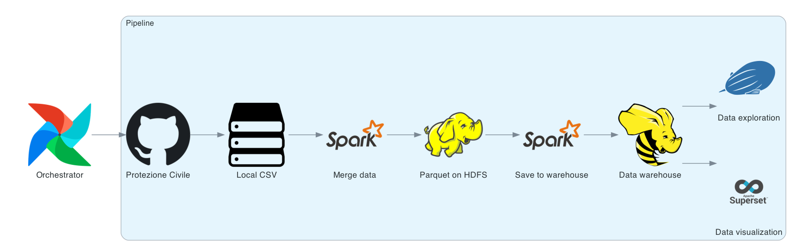
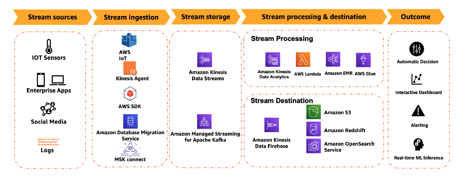
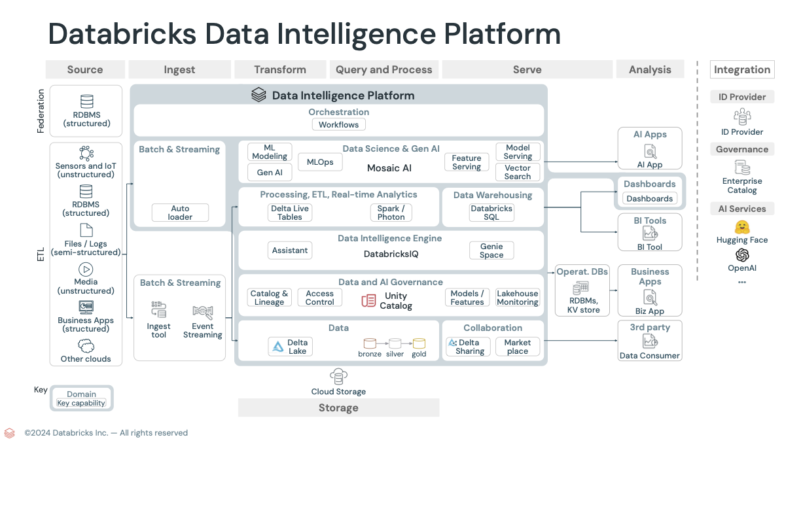

**Table of content :**
<!-- TOC -->
* [Demo of an Apache data pipeline](#demo-of-an-apache-data-pipeline)
  * [Introduction](#introduction)
  * [Expected architecture](#expected-architecture)
  * [Repository structure](#repository-structure)
  * [Test of the "covid" demo](#test-of-the-covid-demo)
    * [Deployment on one virtual machine instance](#deployment-on-one-virtual-machine-instance)
      * [Graphical user interfaces](#graphical-user-interfaces)
        * [Superset](#superset)
      * [Zeppelin](#zeppelin)
      * [Airflow](#airflow)
    * [How the data is processed in this demo](#how-the-data-is-processed-in-this-demo)
    * [Migration from docker compose to K8S with Helm](#migration-from-docker-compose-to-k8s-with-helm)
      * [Tests with Kompose :](#tests-with-kompose-)
      * [Tests with Kompose + Helm + Kapsule](#tests-with-kompose--helm--kapsule)
        * [Ingress controller + cert manager deployment :](#ingress-controller--cert-manager-deployment-)
        * [Helm](#helm)
  * [Progression](#progression)
* [Other examples of data pipelines](#other-examples-of-data-pipelines)
  * [AWS](#aws)
  * [Databricks](#databricks)
<!-- TOC -->

# Demo of an Apache data pipeline

## Introduction

The Apache stack (Kafka, Spark, Airflow...) seems to be the main alternative to the AWS data pipeline (Glue, Kinesis,
Firehose, S3, Athena, Quicksight, Sagemaker...).

A data pipeline stack is generally composed of these services :

|                            | Jobs orchestration | Stream injection | ETL   | Notebooks   | Data warehouse (distributed database of structured data / OLAP)     | Distributed file storage | BI                                 | SQL Query | Distributed compute  | NoSQL distributed databases of raw data (Data Lake) | Data catalog / management |
|----------------------------|--------------------|------------------|-------|-------------|---------------------------------------------------------------------|--------------------------|------------------------------------|-----------|----------------------|-----------------------------------------------------|---------------------------|
| **AWS**                    | Managed Airflow    | Kinesis          | Glue  | Sagemaker   | Redshift                                                            | EFS / EMR                | Quicksight, Kinesis data analytics | Athena    | EMR (managed Hadoop) | DynamoDB                                            |                           |
| **Apache**                 | Airflow            | Kafka, Pulsar    | Kafka | Zeppelin    | Hive                                                                | HDFS                     | Superset                           | Superset  | Spark                | HBase / Cassandra                                   | Atlas                     | 
| **Other famous providers** | Dagster, Kestra    | Rabbit MQ        | ---   | JupyterLabs | Oracle, Trino, Clickhouse (SCW data warehouse = managed Clickhouse) | ---                      | PowerBI                            | Presto    | ---                  |                                                     | Google Data Catalog       |

We want to make a demo of such a pipeline integrated with some Scaleway technologies:

1. Put some parquet fils in object storage
2. Install the Apache software on kubernetes + a managed/serverless postgresql database
3. Pull the data and expose it to dashboards


The Apache stack we want to use is the following:

* Apache **Airflow** for orchestration
  > Created by Airbnb, then Google became the main contributor. Google Cloud Composer is based on Airflow
  > * **Orchestration** = launching workflows periodically. It looks like several jobs launched a Linux crontab. But
      with more features.
  > * DAG = a workflow. It is composed of **tasks**. Tasks can be of 2 types:
      >
    * Operator = a processing
  > * Sensor = a wait for something to happen (ex: receive a data)
* Apache **Spark** for distributed processing
    * Namenode : where the index of the blocks is
    * Datanodes : where the blocks are
* Apache Hadoop **HDFS** (Hadoop distributed file system) for distributed storage
* Apache **Hive** for distributed data warehousing
    * It stores its data on HDFS.
    * You can do SQL queries
    * Hive Metastore store metadata on a Postgre SQL database
    * Hive Server is a service that enables clients to execute queries against Hive
* Apache **Superset** for data visualization, dashboard creation, SQL query
* Apache **Zeppelin** for data exploration and notebook usage

---

## Expected architecture

1. [x] Set up IAM to create an API Key to use S3
2. [x] Upload raw data in Scaleway Object Storage with the CLI

 ```shell
# I added a profile in the config file of the CLI (you can find parameter in the graphical Web console)
# Create a bucket in the good projet
scw object bucket create apachepipeline -p ApachePipelineProfile
# rclone installation 
brew install rclone
# rclone configuration with the cli scw
scw object config install type=rclone -p ApachePipelineProfile
# Download the data from https://github.com/pcm-dpc/COVID-19/tree/master/dati-andamento-nazionale 
# Upload the data to the bucket
rclone  copy /Users/emilienmaudet/Downloads/COVID-19-master/dati-andamento-nazionale apachepipeline:dati-andamento-nazionale
```

3. [ ] Deploy a k8s cluster with Kapsule (si possible multi-az)
4. [ ] Deploy the application in the k8s cluster (with kubectl/Helm)
    * Kompose is a tool to convert docker compose to K8s manifests / Helm
      charts : https://kubernetes.io/docs/tasks/configure-pod-container/translate-compose-kubernetes/
    * Postgres a l'air d'être utilisé pour stocker des meta données de la BDD Hive.
    * 1 autre postrgre a l'air d'être utilisé par Airflow
5. [ ] annotation LB sur service kube
6. [ ] connection VPC kube <=> DB.
    * Replace the postgres created by the docker compose file, by a Scaleway managed database in the private network of
      Kapsule. Like this https://repost.aws/knowledge-center/postgresql-hive-metastore-emr
7. [ ] read-replica pour BI si besoin
8. [] Harden security (disable public ip for K8S nodes)

Architecture simplifiée :


## Repository structure

```shell
.
├── cloud-init.yml # The boot script of the "all in one VM deployment" (basically it installs docker and do a git pull)
├── docker-compose.yml # The docker compose file I modified for the "all in one VM deployment".
├── kompose # The .yaml files for the K8S deployment + the original git repo of the covid-demo
│   ├── README.md
│   ├── covid_data # files saved in HDFS 
│   │   ├── datanode
│   │   ├── namenode
│   ├── dags # airflow configurations/python scripts
│   ├── docker # dockerfiles and configurations
│   │   ├── airflow
│   │   ├── hadoop
│   │   ├── hive
│   │   ├── superset
│   │   └── zeppelin
│   ├── docker-compose-compatible-kompose.yml # The  docker compose file I modified for Kompose compatibility
│   ├── docker-compose.yml # The original docker compose file (does not work)
│   ├── logs
│   ├── notebooks # Zeppelin notebooks (empty)
│   ├── pipeline-helm # The helm Chart 
│   │   ├── Chart.yaml
│   │   ├── charts
│   │   ├── templates # The .yaml files generated by Kompose and modified by me
│   │   └── values.yaml
│   ├── plugins
│   ├── spark # Python scripts executed by Spark
│   └── utils
├── main.tf # Main terraform file (almost empty)
├── modules # Terraform modules : 1 for the K8S deployment, 1 for the "all in one VM deployment
│   ├── pipeline-k8s
│   ├── pipeline-one-public-vm
├── pictures # documentation images
└── readme.md # documentation
```

---

## Test of the "covid" demo

We want to duplicate and adapt [this existing GitHub project]( https://github.com/davide-andreoli/covid_line) which uses
the same Apache stack

### Deployment on one virtual machine instance

1. [ ] Infrastructure provisioning with Terraform

```shell
terraform plan
terraform apply
```

> There is 2 Terraform modules :
> * One to deploy everything on 1 VM
> * One to deploy on a K8S cluster

2. [ ] Replace the original `/opt/covid_line/docker-compose.yml`by this one : [docker-compose.yml](docker-compose.yml).

> I modified these things in the docker-compose.yml :
>1. [ ] I added the profile "zeppelin" to the
    spark-master [Line 192](https://github.com/davide-andreoli/covid_line/blob/13c157fd0ef2c83ea1f6cb7a1c85664b4b514d5d/docker-compose.yml#L192)
>2. [ ] I modified the login/password of superset at
    line [ligne 333](https://github.com/davide-andreoli/covid_line/blob/13c157fd0ef2c83ea1f6cb7a1c85664b4b514d5d/docker-compose.yml#L333)
    because It is compulsory now
>3. [ ] I removed the mentions of the file `/docker/hadoop/config` (it is actually a `.env` file) in the sections
    `env_file` of `docker-compose.yml`). And I replaced by multiple environment variables declarations in the sections
    `environment:`of `docker-compose.yml`.
    >

* The supposed reason : the parsing of special characters (such as the `-` which are in the environment variables names)
  by recent `docker compose` versions is bugged

```shell
# log to the instance with SSH
vi docker-compose-compatible-kompose.yml
#delete then copy the content
```

3. [ ] Build and run containers

```shell
cd /opt/covid_line/
docker compose --profile pipeline build
docker compose --profile superset build
docker compose --profile zeppelin build

docker compose --profile pipeline up
# Wait until it runs
docker compose --profile pipeline down
chmod 777 -R /opt/covid_line/covid_data
# Launch this 3 commands in 3 different terminal if you want to see logs. Otherwise, add -d on each 3 :
docker compose --profile pipeline up
docker compose --profile superset up
docker compose --profile zeppelin up

# If needed (Zeppelin error): 
chown -R 1000:1000 /opt/covid_line/covid_data/notebook # Because it seems there is a user issue : https://forums.docker.com/t/volume-mapping-issue-with-zeppelin/121917/2
```

> To see the logs with `docker compose logs` you must add the "service" name (not the "profile" name associated to
> several services. Such as the profile "pipeline") : `docker compose logs <profile name> -f`
> Ex: `docker compose logs namenode -f`


When you trigger the workflows in Airflow, it should generate `.parquet` files in `HDFS`. You should see it in the HDFS
GUI ("Utilities" --> "Browse the file system". `http://<IP ADRESS>:9870/explorer.html#/`)

If it does not, you can check the logs of Airflow if a conflict exists between the Cluster ID of the namenode and the
datanode :

```shell
docker exec -it airflow-scheduler /bin/bash
cd /opt/airflow/logs/dag_id=get_cases_data/run_id=scheduled__2023-01-10T00:00:00+00:00/task_id=merge_data
cat 'attempt=1.log'
```

To solve the issue

```shell
docker compose --profile hadoop down -v
# -v deletes volumes
```

In `docker-compose.yml`, copy-paste these 2 lines to replace the existing ones (it modifies 2 `:` which must be replaced
by 2 `=`, and reverse comment/uncomment of the two lines) :

```yaml
#ENSURE_NAMENODE_DIR= "/hadoop/dfs/name"
ENSURE_NAMENODE_DIR= "/tmp/hadoop-root/dfs/name"
```

```shell
rm -rf covid_data/namenode/* covid_data/datanode/*
```

Change the comments/uncomments back in `docker-compose.yml` like this :

```yaml
ENSURE_NAMENODE_DIR= "/hadoop/dfs/name"
#ENSURE_NAMENODE_DIR= "/tmp/hadoop-root/dfs/name"
```

```shell
docker compose --profile hadoop up # you can add -d if you don't want to see the logs
```

#### Graphical user interfaces

* HDFS-Hadoop (port **9870**). NB: the documentation is incorrect
  at [line 25](https://github.com/davide-andreoli/covid_line/blob/13c157fd0ef2c83ea1f6cb7a1c85664b4b514d5d/README.md?plain=1#L25)
  of the `readme.md` file.
* Airflow (port `8080`). Default credentials : `airflow` / `airflow`
* Superset (port `8088`). Default credentials: `administrator`/ `administrator`
* Zeppelin (port `2020`)
* Spark (port `4040`)

##### Superset

An example of an SQL query that should work in Superset :

```sql
SELECT `collection_id`,
       `new_positive_cases`,
       `collection_date`,
       `country_cod`
FROM `default`.`cases` LIMIT 100
```

The original query of the author does not work :

```sql
SELECT from_unixtime(unix_timestamp(`collection_date`), 'yyyy-MM-dd 00:00:00') AS `__timestamp`,
       sum(`new_positive_cases`)                                               AS `SUM(new_positive_cases)`
FROM `default`.`cases`
GROUP BY from_unixtime(unix_timestamp(`collection_date`), 'yyyy-MM-dd 00:00:00') LIMIT 10000;

```

#### Zeppelin

* Warning : the developer did not an example Notebook for Zeppelin. He just :
    * Installed the interpreter for Hive (JDBC) but did not configure it
    * Installed and set up Spark interpreter

You must configure the jdbc interpreted (in the top right corner of the GUI --> interpreters --> look for jdbc in the
research bar) and set up these parameters :

| Name             | Value                           | Description            |
|------------------|---------------------------------|------------------------|
| default.url      | jdbc:hive2://hive-server:10000  | 	The URL for JDBC.     |
| default.user     | hive                            | The JDBC user name     |
| default.password | password                        | The JDBC user password |
| default.driver   | org.apache.hive.jdbc.HiveDriver | JDBC Driver Name       |

| Dependencies - Artifact               | 
|---------------------------------------|
| org.apache.hive:hive-jdbc:0.14.0 	    | 
| /spark/jars/hadoop-common-3.2.0.jar 	 | 

Then you can do this request :

```
%jdbc
SELECT * FROM cases
```

For an unknown reason to me, Spark does not reach Hive tables, but the Spark interpreter for Zeppelin seems to work
because these queries return results (that says there is no tables).
Maybe a permission issue between Spark and Hive

```
%spark
spark.sql("SHOW DATABASES").show()
spark.sql("USE default")
spark.sql("show tables").show()
```

To check if the postgreSQL meta-database is ok :

```shell
docker exec -it hive-postgres psql -U hive metastore_db
```

Lister les databases, se connecter à la bonne, lister les tables :

```psql
\l
\c metastore_db
\dt
```

#### Airflow

Logs of the tasks are in : Browse--> Task Instances --> Task id --> logs

### How the data is processed in this demo



* The RAW data are `.csv`files containing Italian covid-19 key indicators (number of people, contaminated, in intensive
  care unit, dead, healed... ).

| data                | stato | ricoverati\_con\_sintomi | terapia\_intensiva | totale\_ospedalizzati | isolamento\_domiciliare | totale\_positivi | variazione\_totale\_positivi | nuovi\_positivi | dimessi\_guariti | deceduti | casi\_da\_sospetto\_diagnostico | casi\_da\_screening | totale\_casi | tamponi   | casi\_testati | note | ingressi\_terapia\_intensiva | note\_test | note\_casi | totale\_positivi\_test\_molecolare | totale\_positivi\_test\_antigenico\_rapido | tamponi\_test\_molecolare | tamponi\_test\_antigenico\_rapido |
|:--------------------|:------|:-------------------------|:-------------------|:----------------------|:------------------------|:-----------------|:-----------------------------|:----------------|:-----------------|:---------|:--------------------------------|:--------------------|:-------------|:----------|:--------------|:-----|:-----------------------------|:-----------|:-----------|:-----------------------------------|:-------------------------------------------|:--------------------------|:----------------------------------|
| 2022-12-27T17:00:00 | ITA   | 8319                     | 334                | 8653                  | 409159                  | 417812           | -5298                        | 8322            | 24487191         | 184324   | null                            | null                | 25089327     | 262223735 | 66763241      | null | 32                           | null       | null       | 9656319                            | 15433008                                   | 99558878                  | 162664857                         |

Here is the French translation of the italian words :

| date | état | hospitalisés_avec_symptômes | thérapie_intensive | total_hospitalisés | isolation_domiciliaire | total_positifs | variazione_totale_positifs | nouveaux_positifs | déchargés_guéris | décédés | cases_suspects | cases_de_dépistage | total_cases | tampons | cases_testés | notes | entrées_en_thérapie_intensive | notes_test | notes_cases |
|------|------|-----------------------------|--------------------|--------------------|------------------------|----------------|----------------------------|-------------------|------------------|---------|----------------|--------------------|-------------|---------|--------------|-------|-------------------------------|------------|-------------|

* `docker compose` build and runs the containers
* Airflow launches 2 workflows (DAG)
    * get_cases_data
        * Download data
          from [Italian Protection Civile GitHub](https://github.com/pcm-dpc/COVID-19/tree/master/dati-andamento-nazionale)
          with `curl`
        * "Merge data" with a `Python`script run by `Spark` .
            * It changes the italian words to english words
            * It changes the date format
            * It selects only 4 relevant fiels over all fields
            * It generates `.parquet`files and save them in `HDFS` (Hadoop distributed file storage)
                * The data is partitioned by "country_code" to optimize query performance and storage efficiency.
        * Save data to the `Hive` warehouse (a distributed database)  with a `Python`script run by `Spark`
            * Read data from Parquet files
            * Check if a Hive table for cases already exists.
            * If it does, update that table by removing duplicate entries and merging new data.
            * If it doesn't, create the table from the new data.

    * test_spark
        * Save data to the `Hive` warehouse (a distributed database)  with a `Python`script run by `Spark` (exactly the
          same operation as previously)

> **Note**  
> To be continued. For the moment, only 1 data seems to be written in Hive. 1 table is created And I do not see it in
> Superset/Zeppelin

> To delete data inside HDFS :
> ```shell
> docker-compose exec hive-server bash
> /opt/hive/bin/beeline -u jdbc:hive2://localhost:10000
> hadoop dfs -rm -r hdfs://namenode:8020/user/hive/warehouse/cases
> ```

### Migration from docker compose to K8S with Helm

Conversion from `docker-compose.yml` to a helm chart:

#### Tests with Kompose :

> I created a [docker-compose-compatible-kompose.yml](kompose/docker-compose-compatible-kompose.yml) (from the original
> one) file with some modifications:
> * Il faut Supprimer tous les blocs "profile" du docker-compose, car Kompose ne les gère pas
> * Kompose gives some warnings when "services" (docker compose services, not K8s services) does not have ports to
    redirect. It says that "service" (K8S service this time) won't be created because 'ports' is not specified. Which is
    logical : K8S services are for network things. No ports --> no network needed. --> I had to create "postgres"
    service manually

```shell
# J'ai du copier tout le projet git (pas seulement le fichier docker-compose.yml) avec les fichiers créés par une première exécution docker-compose dans une VM
# scp without  -O option it did not work
scp -P 2201 -r -O root@51.159.186.220:/opt/covid_line kompose  
mv kompose/covid_line/* kompose/
rm -rf kompose/covid_line

# I choose to run compose in a container on my computer, to not break my "all in one" VM deployment
docker build -t kompose https://github.com/kubernetes/kompose.git\#main

# Go tho the "kompose" directory (where docker-compose-compatible-kompose.yml is)
cd kompose
# Launch Kompose conversion
docker run --rm -it -v $PWD:/opt kompose sh -c "cd /opt && kompose convert -v --file docker-compose-compatible-kompose.yml" > outputKompose.log
# -v = verbose mode
```

I modified this .yml files to avoid
these [Helm errors](https://stackoverflow.com/questions/55673385/helm-upgrade-fails-with-function-x-not-defined) :

* [airflow-webserver-cm0-configmap.yaml](kompose/pipeline-helm/templates/airflow-webserver-cm0-configmap.yaml)
* [airflow-triggerer-cm0-configmap.yaml](kompose/pipeline-helm/templates/airflow-triggerer-cm0-configmap.yaml)
* [airflow-scheduler-cm0-configmap.yaml](kompose/pipeline-helm/templates/airflow-scheduler-cm0-configmap.yaml)

I modified all PersistentVolumeClaim .yml files : change storage size from 100Gi to at least 1Gi . Because Scaelway
minimum volume size is 1Gi

The modification is to add brackets+backquotes to existing brackets. Modifying :

```python
{{execution_date  #### }}
```

by

```python
{{`{{execution_date  #### }}`}}
```

I modified  **all** the `xxxxxxx-service.yml` files : In the file, change the name of the `service` from `xxxx` to
`xxxx-service` otherwise you will have errors

* Ex: [superset-service.yaml](kompose/pipeline-helm/templates/superset-service.yaml)
    * I changed the name of the `service` from `superset` to `superset-service` otherwise you will have this error :  _"
      tcp is not a valid port number"_
* Ex: [zeppelin-service.yaml](kompose/pipeline-helm/templates/zeppelin-service.yaml)
    * I changed the name of the `service` from `zeppelin` to `zeppelin-service` otherwise you will have this error :  _"
      Key 'ZEPPELIN PORT' cannot be converted to class..."_
* etc. for all other service files

I modified the file [airflow-init-deployment.yaml](kompose/pipeline-helm/templates/airflow-init-deployment.yaml)

* Some bash syntaxes were wrong (I asked ChatGPT...)
*
    * delete a gosu command because of
      this [error](https://stackoverflow.com/questions/72608605/airflowpermission-error-is-coming-when-i-am-running-with-docker) :

I modified [postgres-deployment.yaml](kompose/pipeline-helm/templates/postgres-deployment.yaml)
and [hive-postgres-deployment.yaml](kompose/pipeline-helm/templates/hive-postgres-deployment.yaml)

* Add a "PGDATA" environment variable to handle
  this [error](https://stackoverflow.com/questions/62697071/docker-compose-postgres-upgrade-initdb-error-directory-var-lib-postgresql-da)

I modified [datanode-deployment.yaml](kompose/pipeline-helm/templates/datanode-deployment.yaml)
and [namenode-deployment.yaml](kompose/pipeline-helm/templates/namenode-deployment.yaml)

* delete quotes in the env variable `ENSURE_NAMENODE_DIR` value.
* Add PVC
* Add a chown 1000:1000
* replace namenode:8020 by 0.0.0.0:8020 in namenode deployment, and add this port in the namenode service

Kompose did not import all configurations files of
this [folder](https://github.com/davide-andreoli/covid_line/tree/main/docker) . But they are used to `COPY`some
important files inside the volumes.
inside pods. I needed to :

* Add `+x` permission to the `init-hive.sh script` in 2 deployment.yaml files
* create configmaps and call them in `xxx-deployment.yaml` files.

```shell
kubectl create configmap hive-metastore-cm0 --from-file=docker/hive --dry-run=client -o yaml > pipeline-helm/templates/hive-metastore-cm0-configmap.yaml 
kubectl create configmap superset-cm0 --from-file=docker/superset/ --dry-run=client -o yaml > pipeline-helm/templates/superset-cm0-configmap.yaml 
kubectl create configmap airflow-cm0 --from-file=docker/airflow --dry-run=client -o yaml > pipeline-helm/templates/airflow-cm0-configmap.yaml 
kubectl create configmap hadoop-cm0 --from-file=docker/hadoop --dry-run=client -o yaml > pipeline-helm/templates/hadoop-cm0-configmap.yaml 
kubectl create configmap zeppelin-cm0 --from-file=docker/zeppelin --dry-run=client -o yaml > pipeline-helm/templates/zeppelin-cm0-configmap.yaml 
#For airflow I merged 
kubectl create configmap zeppelin-cm0 --from-file=docker/zeppelin --dry-run=client -o yaml > pipeline-helm/templates/zeppelin-cm0-configmap.yaml 
#with the existing configmaps
# for Superset I added
kubectl create configmap superset-cm0-charts --from-file=docker/superset/dashboard_export/charts --dry-run=client -o yaml > pipeline-helm/templates/superset-cm0-charts-configmap.yaml 
kubectl create configmap superset-cm0-dashboards --from-file=docker/superset/dashboard_export/dashboards --dry-run=client -o yaml > pipeline-helm/templates/superset-cm0-dashboards-configmap.yaml 
kubectl create configmap superset-cm0-dashboards-databases --from-file=docker/superset/dashboard_export/databases --dry-run=client -o yaml > pipeline-helm/templates/superset-cm0-dashboards-databases-configmap.yaml 
kubectl create configmap superset-cm0-datasets-hive --from-file=docker/superset/dashboard_export/datasets/hive_connection --dry-run=client -o yaml > pipeline-helm/templates/superset-cm0-datasets-hive-configmap.yaml 
kubectl create configmap superset-cm0-dashboard-metadata --from-file=docker/superset/dashboard_export/metadata.yaml --dry-run=client -o yaml > pipeline-helm/templates/superset-cm0-dashboard-metadata-configmap.yaml 
kubectl create configmap superset-cm0-database-hive --from-file=docker/superset/database_export/databases/hive_connection.yaml --dry-run=client -o yaml > pipeline-helm/templates/superset-cm0-database-hive-configmap.yaml 
kubectl create configmap superset-cm0-database-hive-cases --from-file=docker/superset/database_export/datasets/hive_connection/cases.yaml --dry-run=client -o yaml > pipeline-helm/templates/superset-cm0-database-dataset-hive-configmap.yaml 
kubectl create configmap superset-cm0-database-metadata --from-file=docker/superset/database_export/metadata.yaml --dry-run=client -o yaml > pipeline-helm/templates/superset-cm0-database-metadata-configmap.yaml 

kubectl create configmap superset-cm0-zip --from-file=docker/superset/database_export.zip --from-file=docker/superset/dashboard_export.zip --dry-run=client -o yaml > pipeline-helm/templates/superset-cm0-zip-configmap.yaml 
#I also create one by hand for superset

```

Basically I made a lot of changes to manifests generated by Kompose:

* I added commands to do as docker instructions `COPY`, `RUN`... have done
* I modified some parameters to be compatible with k8s network
* There is a k8s mode to disable in Zeppelin (otherwise it creates pods for each interpreter. And I did not make them
  work)

Change a airflow init deployment by a job. Car Le déploiement AirFlow-init est à lancer que 1 fois.

--> Attention j'ai mis une archive apache dans un S3 Scaleway public pour éviter de la télécharger depuis le serveur
apache.org --> A ENLEVER
--> ATTENTION J'ai mis une image dans mon registry Scaleway public

Upload de l'image construite par docker compose Depuis la VM. Car on a besoin d'installer Java par dessus l'image
officielle d'Airflow. Je n'ai pas réussi avec K8S
Idem pour hive : besoin d'installer postgre

```shell
docker login rg.fr-par.scw.cloud/namespace-pipeline -u nologin --password-stdin <<< MACLEDAPISECRETE
docker tag apache/airflow:2.7.0-python3.9 rg.fr-par.scw.cloud/namespace-pipeline/airflow-scheduler:2.5
docker push rg.fr-par.scw.cloud/namespace-pipeline/airflow-scheduler:2.5

docker tag apache/hive:3.1.3 rg.fr-par.scw.cloud/namespace-pipeline/hive-server
docker push rg.fr-par.scw.cloud/namespace-pipeline/hive-server
```

#### Tests with Kompose + Helm + Kapsule

##### Ingress controller + cert manager deployment :

```shell
#  nginx ingress controller 
helm upgrade --install ingress-nginx ingress-nginx --repo https://kubernetes.github.io/ingress-nginx --namespace ingress-nginx --create-namespace --set="controller.ingressClassResource.default=true" --set="controller.ingressClassResource.enabled=true" --set="controller.service.type=LoadBalancer"

# cert manager 
helm upgrade --install cert-manager cert-manager --repo https://charts.jetstack.io --namespace cert-manager --create-namespace --set="crds.enabled=true"
# add an issuer :
cat<<EOF | kubectl apply -f -
apiVersion: cert-manager.io/v1
kind: ClusterIssuer
metadata:
  name: lets-encrypt
spec:
  acme:
    email: solutions-architects-team@scaleway.com
    server: https://acme-v02.api.letsencrypt.org/directory
    privateKeySecretRef:
      name: issuer-account-key
    solvers:
    - http01:
        ingress:
          ingressClassName: nginx
EOF
```

I get the public IP of the Load Balancer pour ajouter une entrée DNS

```shell
kubectl get svc ingress-nginx-controller -n ingress-nginx
```

Then I do a DSN records in Scaleway console (SA Build organization)

I created one ingress by service to publicly expose on the internet.
In each ingress there is a TLS/certificate to use, a subdomain/domain to use, and a port to expose to the LB.
Ex: [superset-ingress.yaml](kompose/pipeline-helm/templates/superset-ingress.yaml)

I created a certificate signing requests. It will be handled by cert-manager.
[certificate.yaml](kompose/pipeline-helm/templates/airflow-webserver-certificate.yaml)

##### Helm

```shell
# Move files to an Helm Chart
helm create pipeline-helm
mv pipeline-chart/templates airflow* hive* spark-* namenode* datanode* superset* warehouse* superset* zeppelin* postgre-* pipeline-helm/templates/
chmod +x /kompose/docker/superset/superset_init.sh

# deploy to Kapsule
kubectl create namespace pipeline-namespace
helm install pipeline-helm-release pipeline-helm --namespace=pipeline-namespace

#If needed, delete pipeline from the cluster : 
helm delete pipeline-helm-release pipeline-helm --namespace=pipeline-namespace
# Check the deployment :
kubectl get pods -n pipeline-namespace
```

Debug :

```shell
# deploylment of only one .yaml file :
kubectl apply -f templates/warehouse-persistentvolumeclaim.yaml -n pipeline-namespace
kubectl describe pvc warehouse -n pipeline-namespace
kubectl logs -n pipeline-namespace NameOfThePod 
```

## Progression
> Today (november 2024), the Helm deployment does not fully work. Especially Airflow/Spark communication. For the next step, we plan to use official Helm charts of Airflow (and potentially official chart for all components Spark, Hive, Zeppelin...) instead of our "home made" installations.

---

# Other examples of data pipelines


## AWS



## Databricks


